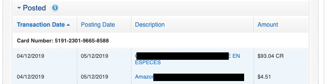

# BMO-Credit-Balance
This extension provides you with the credit card balance after each transaction on your BMO card.

Some banks such as TD show you the credit card balance after each transaction but BMO'S interface does not show this. instead it just shows the amount you spent/paid. This extension will provide this extra information.

Features:
-   display credit card balance after each transaction
-   sort using pre-existing features and the new information will still be displayed

Notes:
-   only works on the 'Recent Transactions' page
-   works automatically on pages that match "https://www13.bmo.com/*MCDetails*"

## Before

## After

This extension will automatically add the Debit/Credit/Balance columns and fill in the details. when the user sorts using the transaction date, posting date, description, or amount, the correct information will be filled in for each row.

Note:
    The way BMO does sorting is not how you'd expect. When transaction date is sorted in reverse order, the dates will be in descending order but transactions from the same day someitems get switched around. This sorting is done by BMO. This extension matches the extra debit/credit/balance information to each row so the balance may be shown out of order due to BMO's reverse sorting

Icon made by Pixel perfect from www.flaticon.com
